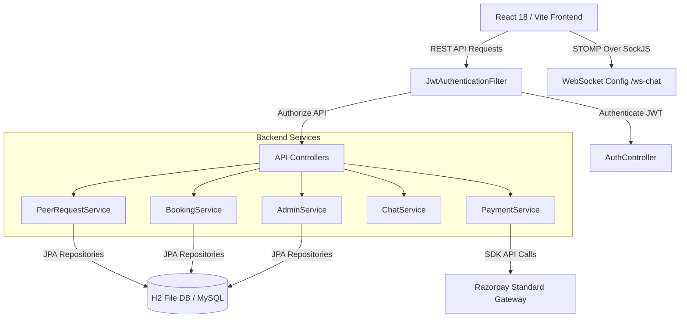

# 🎓 SkillMentor Platform

[](https://spring.io/projects/spring-boot)
[](https://reactjs.org/)
[](https://vitejs.dev/)
[](https://www.oracle.com/java/)
[](https://tailwindcss.com/)
[](https://razorpay.com/)


> **Multi-Program Peer Learning, Mentorship & Student Help Request Platform running on a Hybrid Economy.**

---

## 📌 Executive Summary

**SkillMentor** is an all-in-one educational platform engineered to connect students across multiple academic programs (`BTech`, `MCA`, `BBA`, `MBA`, `LLB`, and more) for peer-to-peer assistance, skill swapping, and professional 1-on-1 mentorship.

The platform operates on a **Hybrid Economy Engine**:
1. **⚡ SkillMentor Free Credit Tokens**: Powers student-to-student peer help requests and zero-cost reciprocal skill exchanges.
2. **💳 Real Money INR (₹)**: Enables paid 1-on-1 mentorship sessions with verified alumni and industry mentors, secured via Razorpay Standard Checkout.

---

## 🌟 Key Features & Core Modules

### 1. ⚡ Peer Help Requests & Reciprocal Skill Exchange
- **Categorized Requests**: Students create help requests under categories such as `SKILL_LEARNING`, `PROJECT_HELP`, `DOUBT_SOLVING`, `ACADEMIC_HELP`, `CAREER_GUIDANCE`, `INTERVIEW_PREPARATION`, `RESUME_PROFILE`, and `MENTORSHIP`.
- **Credit Escrow System**: Budgets credit tokens for requests. Credits are held in escrow when a helper is selected and automatically transferred to the helper upon task completion.
- **Smart Reciprocal Matcher**: Automatically matches students with complementary skills (`Student A teaches X & wants Y` $\leftrightarrow$ `Student B teaches Y & wants X`) for zero-credit mutual skill swaps.

### 2. 🎓 Same-College Alumni Benefit & Dynamic Pricing
- **Verified Status**: Mentors and Alumni undergo identity verification (LinkedIn URL, Govt ID, and company proof).
- **Alumni Discount**: Verified alumni can grant **100% Free** or **Percentage Discounted** guidance to students enrolled in the same college (`student.collegeName` matches `mentor.collegeName`).

### 3. 🗓️ Structured Availability & User Identity
- **Schedule Editor (`AvailabilityEditor.jsx`)**: Structured weekly schedule planner (Monday through Sunday) with custom time ranges.
- **Dynamic Role Badge**: Exposes user roles (`STUDENT`, `MENTOR`, `ALUMNI`, `ADMIN`) across discovery cards, profile modals, and live chat sessions.

### 4. 💬 Real-Time Live Chat (STOMP WebSockets)
- **Bi-Directional Messaging**: Real-time communication powered by WebSockets (`STOMP` over `SockJS`) with HTTP REST API fallbacks.
- **Security & Authorization**: Server-side checks enforce that only active session participants can exchange messages. Messaging is automatically locked on `CANCELLED` or `REJECTED` sessions.

### 5. 💳 Razorpay Web Checkout Integration
- **Secure Payment Flow**: Seamless creation of Razorpay Orders (`/api/payments/razorpay/order`) and server-side HMAC SHA-256 signature verification (`/api/payments/razorpay/verify`).
- **Idempotency Guard**: Prevents duplicate order creation and ensures safe state transitions for mentorship sessions.

### 6. 🛠️ Admin Governance & Verification Portal
- **Verification Workbench**: Review pending mentor credentials (LinkedIn, document verification, company details) with Approve/Reject actions.
- **Moderation & Auditing**: User suspension controls, report resolution workflows, and immutable audit logs (`AdminActionLog`).

---

## 🏗️ Architecture & Technology Stack

### Tech Stack Matrix

| Tier | Technology | Purpose |
| :--- | :--- | :--- |
| **Backend Framework** | Spring Boot 3.2.3 | Core Web API & Application Engine |
| **Language** | Java 17 | Primary Programming Language |
| **Security** | Spring Security + JJWT 0.12.5 | Authentication & Stateless Token Management |
| **Database** | Embedded H2 File DB (`skillmentor_db`) | Default Persistence Engine (MySQL compatible) |
| **OR Framework** | Spring Data JPA / Hibernate | Object-Relational Mapping & Query Generation |
| **Real-time Messaging** | Spring WebSocket (STOMP + SockJS) | Live Session Chat |
| **Payments** | Razorpay Java SDK 1.4.6 | Payment Gateway Processing |
| **Documentation** | SpringDoc OpenAPI 2.3.0 | Swagger UI API Specs (`/swagger-ui.html`) |
| **Frontend Framework**| React 18.2 + Vite 7.3 | High-performance Single Page Application |
| **Styling** | Tailwind CSS 3.4 + Vanilla CSS | Modern UI Styling & Design Tokens |
| **Icons** | Lucide React | Visual UI Icons |

---

## 📐 System Architecture Diagram



---

## 🗄️ Database Schema & Entities Overview

```
User (id, name, email, password, role, verificationStatus, collegeName, course, bio, hourlyRate, alumniBenefitType, alumniDiscountPercent)
 ├── UserSkill (id, userId, skillName, type[OFFERED|WANTED], proficiency)
 ├── Wallet (id, userId, creditBalance)
 ├── PeerRequest (id, requesterId, title, category, program, creditBudget, status)
 │    └── RequestApplication (id, requestId, helperId, message, status)
 ├── ReciprocalMatch (id, userAId, userBId, requestAId, requestBId, status)
 ├── MentorshipSession (id, studentId, mentorId, scheduledTime, sessionType, creditCost, priceInINR, status)
 │    └── ChatMessage (id, sessionId, senderId, message, timestamp)
 ├── Payment (id, sessionId, razorpayOrderId, razorpayPaymentId, razorpaySignature, amount, status)
 ├── Review (id, sessionId, mentorId, studentId, rating, feedback)
 └── MentorVerification (id, userId, linkedinUrl, govtIdDocumentPath, stage, adminNotes)
```

---

## 📁 Repository Directory Structure

```
skillmentor/
├── skillmentor-backend/            # Spring Boot Backend Service
│   ├── src/
│   │   ├── main/
│   │   │   ├── java/com/skillmentor/
│   │   │   │   ├── config/         # Security, WebSocket, Swagger, Seeder Configs
│   │   │   │   ├── controller/     # REST Controllers (Auth, Peer, Booking, Payment, Admin)
│   │   │   │   ├── dto/            # Data Transfer Objects
│   │   │   │   ├── model/          # JPA Domain Entities
│   │   │   │   ├── repository/     # Spring Data JPA Repositories
│   │   │   │   ├── security/       # JWT Filters & UserDetails
│   │   │   │   └── service/        # Core Business Logic Services
│   │   │   └── resources/
│   │   │       ├── application.properties
│   │   │       └── application-mysql.properties
│   │   └── test/                   # JUnit 5 Service & Controller Unit Tests
│   └── pom.xml
│
├── skillmentor-frontend/           # React + Vite Frontend Application
│   ├── src/
│   │   ├── components/             # React Modular Components (Dashboards, Modals, Views)
│   │   ├── services/               # Fetch API Client & Request Helpers
│   │   ├── utils/                  # Date & String Formatter Helpers
│   │   ├── App.jsx                 # Main Application Layout & State Router
│   │   └── index.css               # Global Styling & Design Tokens
│   ├── package.json
│   └── vite.config.js
│
├── brain.md                        # Architectural Blueprint & Production Specification
└── README.md                       # Project GitHub Documentation
```

---

## ⚡ Quick Start & Setup Guide

### 📋 Prerequisites
- **Java Development Kit (JDK)**: 17 or higher
- **Apache Maven**: 3.8+
- **Node.js**: v18.0.0 or higher
- **npm**: v9.0.0 or higher

---

### 1️⃣ Setting Up the Backend

```bash
# Navigate to backend directory
cd skillmentor-backend

# Build and start Spring Boot Application (Port 8080)
mvn clean spring-boot:run
```

Once started, access:
- **API Base Endpoint**: `http://localhost:8080/api`
- **Swagger OpenAPI Documentation**: `http://localhost:8080/swagger-ui.html`
- **H2 Console**: `http://localhost:8080/h2-console` (JDBC URL: `jdbc:h2:file:./data/skillmentor_db`, User: `sa`, Password: *blank*)

---

### 2️⃣ Setting Up the Frontend

```bash
# Open a new terminal and navigate to frontend directory
cd skillmentor-frontend

# Install dependencies
npm install

# Start Vite Development Server (Port 5173)
npx vite --host 0.0.0.0 --port 5173
```

Open your browser and navigate to **`http://localhost:5173`**.

---

## 🔐 Seeded Test Accounts

The platform automatically seeds demo accounts upon startup via `DatabaseSeeder.java`:

| Role | Email | Password | Details |
| :--- | :--- | :--- | :--- |
| 🎓 **Student** | `student@jssaten.ac.in` | `password123` | Pre-loaded with ⚡ 50 Credit Tokens |
| 👔 **Mentor** | `mentor.alex@tech.com` | `password123` | Verified Senior Tech Mentor |
| 🎓 **Alumni** | `alumni.sarah@faang.com` | `password123` | Verified Alumni with Same-College Free Benefit |
| 🛠️ **Admin** | `admin@skillmentor.com` | `password123` | Full access to Admin Governance Panel |

---

## 📡 API Endpoint Overview

### Authentication (`/api/auth`)
- `POST /api/auth/register` - Register a new user (`STUDENT`, `MENTOR`, `ALUMNI`)
- `POST /api/auth/login` - Authenticate user & receive JWT token

### Peer Requests & Swaps (`/api/peer-requests`)
- `GET /api/peer-requests` - List active peer requests (filtered by program/category)
- `POST /api/peer-requests` - Create a peer help request with credit budget
- `POST /api/peer-requests/{id}/apply` - Apply to help on a request
- `POST /api/peer-requests/{id}/select/{applicationId}` - Select helper & lock session
- `POST /api/peer-requests/{id}/complete` - Mark complete & transfer wallet credits

### Mentorship Sessions (`/api/bookings`)
- `POST /api/bookings` - Book a 1-on-1 session with a mentor
- `GET /api/bookings` - Retrieve user sessions
- `PATCH /api/bookings/{sessionId}/status` - Accept / Reject session

### Razorpay Payments (`/api/payments/razorpay`)
- `POST /api/payments/razorpay/order` - Generate Razorpay Order ID
- `POST /api/payments/razorpay/verify` - Verify signature & activate session

### Live Chat (`/api/chat` & `/ws-chat`)
- `WS /ws-chat` - STOMP WebSocket connection
- `SEND /app/chat.send/{sessionId}` - Dispatch real-time message
- `GET /api/chat/history/{sessionId}` - Retrieve session chat history

---

## 🧪 Running Unit Tests

Run the unit test suite for backend services:

```bash
cd skillmentor-backend
mvn test
```

<p align="center">
  Crafted with ❤️ for student learning and mentorship networks.
</p>
# skillmentor

