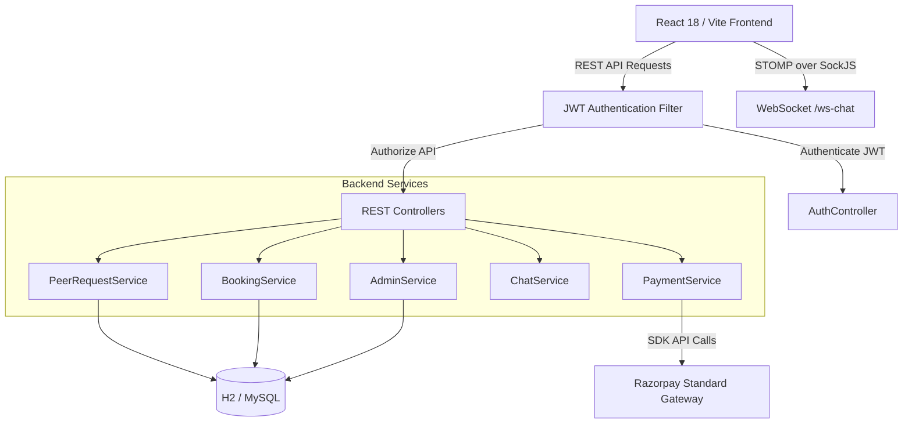

# 🎓 SkillMentor

> **Multi-Program Peer Learning, Mentorship & Student Help Request Platform running on a Hybrid Economy.**

<p align="center">


</p>

---

## 📌 Overview

**SkillMentor** is an educational platform designed to connect students across multiple academic programs such as **BTech, MCA, BBA, MBA, LLB**, and more.

The platform enables students to:

* Get help from other students.
* Exchange skills using a credit-based system.
* Find mentors and alumni.
* Book 1-on-1 mentorship sessions.
* Communicate through real-time chat.
* Access discounted or free guidance from verified same-college alumni.

### 💡 Hybrid Economy

SkillMentor uses two types of transactions:

| Economy                   | Purpose                                                    |
| ------------------------- | ---------------------------------------------------------- |
| ⚡ **Free Credit Tokens**  | Student-to-student peer help and reciprocal skill exchange |
| 💳 **Real Money (INR ₹)** | Paid 1-on-1 mentorship sessions through Razorpay           |

---

# 🌟 Key Features

## 1. ⚡ Peer Help Requests & Skill Exchange

Students can create help requests based on their requirements.

### Request Categories

* `SKILL_LEARNING`
* `PROJECT_HELP`
* `DOUBT_SOLVING`
* `ACADEMIC_HELP`
* `CAREER_GUIDANCE`
* `INTERVIEW_PREPARATION`
* `RESUME_PROFILE`
* `MENTORSHIP`

### Credit Escrow

When a helper is selected:

1. The required credits are locked.
2. The helper completes the task.
3. Credits are transferred to the helper after completion.

### 🔄 Reciprocal Skill Matcher

The platform can identify students with complementary skills.

For example:

```text
Student A:
Offers → Java
Wants  → React

Student B:
Offers → React
Wants  → Java
```

The system can identify this as a potential **zero-credit reciprocal skill exchange**.

---

## 2. 🎓 Same-College Alumni Benefits

Verified mentors and alumni can provide special benefits to students from the same college.

### Verification

Mentor/alumni verification can include:

* LinkedIn profile
* Government ID document
* Company information

### Alumni Benefits

Verified alumni can provide:

* **100% free guidance**
* **Percentage-based discounts**

The benefit can be applied when the student's college matches the mentor's college.

---

## 3. 🗓️ Availability & User Identity

### Structured Availability

The platform provides a weekly availability editor where mentors can configure:

* Monday–Sunday schedules
* Custom time ranges
* Available mentorship slots

### Dynamic Role Badges

The system supports:

* 🎓 `STUDENT`
* 👔 `MENTOR`
* 🎓 `ALUMNI`
* 🛠️ `ADMIN`

These roles are displayed across relevant parts of the application.

---

## 4. 💬 Real-Time Live Chat

SkillMentor provides real-time communication using:

* Spring WebSocket
* STOMP
* SockJS

### Features

* Bi-directional messaging
* Real-time message delivery
* Chat history
* HTTP REST fallback
* Session-based authorization

Only active session participants can exchange messages.

Chat access is automatically restricted for sessions that are:

* `CANCELLED`
* `REJECTED`

---

## 5. 💳 Razorpay Payment Integration

SkillMentor supports Razorpay Standard Checkout for paid mentorship sessions.

### Payment Flow

```text
Student
   ↓
Book Mentorship Session
   ↓
Create Razorpay Order
   ↓
Razorpay Checkout
   ↓
Payment
   ↓
Server-Side Signature Verification
   ↓
Payment Confirmed
   ↓
Mentorship Session Activated
```

### Security

The backend performs:

* Razorpay order creation
* Server-side payment verification
* HMAC SHA-256 signature verification
* Duplicate order protection
* Safe session state transitions

> ⚠️ Razorpay credentials must be supplied through environment variables and should never be committed to GitHub.

---

## 6. 🛠️ Admin Governance & Verification

The admin panel provides platform management capabilities.

### Verification Workbench

Admins can review:

* Mentor verification requests
* LinkedIn information
* Documents
* Company details

Admins can:

* Approve verification
* Reject verification

### Moderation & Auditing

The platform also supports:

* User suspension
* Report resolution
* Administrative actions
* Audit logging

---

# 🏗️ System Architecture

## Technology Stack

| Layer                 | Technology                        | Purpose                            |
| --------------------- | --------------------------------- | ---------------------------------- |
| **Backend**           | Spring Boot 3.2.3                 | REST API & application engine      |
| **Language**          | Java 17                           | Backend development                |
| **Security**          | Spring Security + JJWT 0.12.5     | JWT authentication & authorization |
| **Database**          | H2 / MySQL                        | Data persistence                   |
| **ORM**               | Spring Data JPA / Hibernate       | Object-relational mapping          |
| **Real-Time**         | Spring WebSocket + STOMP + SockJS | Live chat                          |
| **Payments**          | Razorpay Java SDK 1.4.6           | Mentorship payments                |
| **API Documentation** | SpringDoc OpenAPI 2.3.0           | Swagger API documentation          |
| **Frontend**          | React 18.2 + Vite 7.3             | Single-page application            |
| **Styling**           | Tailwind CSS 3.4 + CSS            | UI styling                         |
| **Icons**             | Lucide React                      | UI icons                           |

---

# 📐 System Architecture Diagram



---

# 🗄️ Database Schema

The major entities in the application are:

```text
User
│
├── UserSkill
├── Wallet
├── PeerRequest
│   └── RequestApplication
│
├── ReciprocalMatch
│
├── MentorshipSession
│   └── ChatMessage
│
├── Payment
├── Review
└── MentorVerification
```

### Entity Overview

| Entity               | Purpose                                    |
| -------------------- | ------------------------------------------ |
| `User`               | User profile, role and account information |
| `UserSkill`          | Offered/wanted skills                      |
| `Wallet`             | Credit token balance                       |
| `PeerRequest`        | Student help requests                      |
| `RequestApplication` | Applications from potential helpers        |
| `ReciprocalMatch`    | Mutual skill exchange                      |
| `MentorshipSession`  | 1-on-1 mentorship booking                  |
| `ChatMessage`        | Session chat messages                      |
| `Payment`            | Razorpay payment information               |
| `Review`             | Mentor/student session reviews             |
| `MentorVerification` | Mentor/alumni verification information     |

---

# 📁 Repository Structure

```text
skillmentor/
│
├── README.md
├── .gitignore
│
├── skillmentor-backend/
│   ├── src/
│   │   ├── main/
│   │   │   ├── java/com/skillmentor/
│   │   │   │   ├── config/
│   │   │   │   ├── controller/
│   │   │   │   ├── dto/
│   │   │   │   ├── model/
│   │   │   │   ├── repository/
│   │   │   │   ├── security/
│   │   │   │   └── service/
│   │   │   │
│   │   │   └── resources/
│   │   │       ├── application.properties
│   │   │       └── application-mysql.properties
│   │   │
│   │   └── test/
│   │
│   ├── .env.example
│   ├── .gitignore
│   └── pom.xml
│
└── skillmentor-frontend/
    ├── src/
    │   ├── components/
    │   ├── services/
    │   ├── utils/
    │   ├── App.jsx
    │   └── index.css
    │
    ├── public/
    ├── .env.example
    ├── .gitignore
    ├── package.json
    ├── package-lock.json
    └── vite.config.js
```

---

# ⚡ Getting Started

## 📋 Prerequisites

Make sure the following are installed:

* **JDK:** Java 17+
* **Maven:** 3.8+
* **Node.js:** Compatible with the project's Vite version
* **npm:** 9+

---

## 🔐 Environment Variables

Before starting the application, create the required environment configuration.

Use the provided example file:

```text
.env.example
```

Create your local `.env` file and add your own development credentials.

### Example

```env
RAZORPAY_KEY_ID=your_razorpay_test_key_id
RAZORPAY_KEY_SECRET=your_razorpay_test_key_secret
```

> Never commit `.env` or real credentials to GitHub.

---

# 🚀 Backend Setup

Navigate to the backend:

```bash
cd skillmentor-backend
```

Install/build and start the Spring Boot application:

```bash
mvn clean spring-boot:run
```

The backend runs on:

```text
http://localhost:8080
```

### API Base URL

```text
http://localhost:8080/api
```

### Swagger UI

```text
http://localhost:8080/swagger-ui.html
```

### H2 Console

```text
http://localhost:8080/h2-console
```

Default development database:

```text
jdbc:h2:file:./data/skillmentor_db
```

---

# 💻 Frontend Setup

Open a new terminal:

```bash
cd skillmentor-frontend
```

Install dependencies:

```bash
npm install
```

Start the development server:

```bash
npm run dev
```

The frontend runs on:

```text
http://localhost:5173
```

---

# 🔐 Demo Accounts

The application provides development/demo accounts through `DatabaseSeeder.java`.

| Role       | Email                    | Password      | Details                 |
| ---------- | ------------------------ | ------------- | ----------------------- |
| 🎓 Student | `student@jssaten.ac.in`  | `password123` | 50 Credit Tokens        |
| 👔 Mentor  | `mentor.rajeev@tech.com`   | `password123` | Verified Mentor         |
| 🎓 Alumni  | `alumni.himanshu@faang.com` | `password123` | Verified Alumni         |
| 🛠️ Admin  | `admin@skillmentor.com`  | `password123` | Admin Governance Access |

> **Note:** These are development/demo credentials only. Do not use these credentials in production.

---

# 📡 API Overview

## Authentication

**Base URL:** `/api/auth`

| Method | Endpoint    | Description                       |
| ------ | ----------- | --------------------------------- |
| `POST` | `/register` | Register a new user               |
| `POST` | `/login`    | Authenticate user and receive JWT |

---

## Peer Requests & Skill Exchange

**Base URL:** `/api/peer-requests`

| Method | Endpoint                       | Description                           |
| ------ | ------------------------------ | ------------------------------------- |
| `GET`  | `/`                            | List active peer requests             |
| `POST` | `/`                            | Create a peer help request            |
| `POST` | `/{id}/apply`                  | Apply to help on a request            |
| `POST` | `/{id}/select/{applicationId}` | Select a helper                       |
| `POST` | `/{id}/complete`               | Complete request and transfer credits |

---

## Mentorship Sessions

**Base URL:** `/api/bookings`

| Method  | Endpoint              | Description               |
| ------- | --------------------- | ------------------------- |
| `POST`  | `/`                   | Book a mentorship session |
| `GET`   | `/`                   | Retrieve user sessions    |
| `PATCH` | `/{sessionId}/status` | Accept/reject session     |

---

## Razorpay Payments

**Base URL:** `/api/payments/razorpay`

| Method | Endpoint  | Description              |
| ------ | --------- | ------------------------ |
| `POST` | `/order`  | Create Razorpay order    |
| `POST` | `/verify` | Verify payment signature |

---

## Live Chat

**REST Base URL:** `/api/chat`

| Method | Endpoint               | Description           |
| ------ | ---------------------- | --------------------- |
| `GET`  | `/history/{sessionId}` | Retrieve chat history |

### WebSocket

```text
WS /ws-chat
```

### Send Message

```text
SEND /app/chat.send/{sessionId}
```

---

# 🧪 Testing

Run backend tests:

```bash
cd skillmentor-backend
mvn test
```

The project uses **JUnit 5** for backend testing.

---

# 🔒 Security

SkillMentor implements several security mechanisms:

* JWT-based authentication
* Spring Security
* BCrypt password hashing
* Stateless authentication
* Role-based authorization
* Server-side session authorization
* Razorpay HMAC signature verification
* Environment-based credential management
* Development-only demo data seeding

---

# 💳 Payment Security

Razorpay is integrated using the following flow:

```text
Frontend
   ↓
Backend creates Razorpay Order
   ↓
Razorpay Checkout
   ↓
Payment Completed
   ↓
Backend receives Payment Details
   ↓
HMAC Signature Verification
   ↓
Payment Status Updated
   ↓
Mentorship Session Activated
```

Only **Razorpay test credentials** should be used during development.

---

# 🧪 Development Database

H2 is used for convenient local development.

MySQL configuration is also included for environments where a persistent relational database is required.

The project supports:

```text
Development → H2
Deployment   → MySQL
```

## ❤️ Acknowledgement

<p align="center">
  Built with ❤️ as a student project focused on peer learning, mentorship, and skill exchange.
</p>
